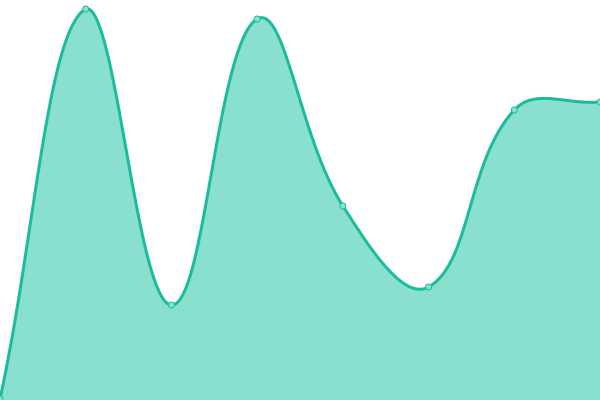
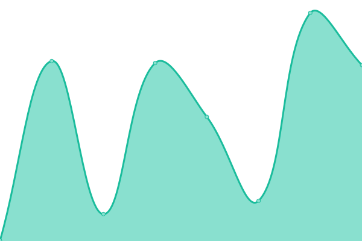

# [📈 Live Status](https://demo.upptime.js.org): <!--live status--> **🟧 Partial outage**

This repository contains the open-source uptime monitor and status page for [belo](https://belo.app), powered by [Upptime](https://github.com/upptime/upptime).

With [Upptime](https://upptime.js.org), you can get your own unlimited and free uptime monitor and status page, powered entirely by a GitHub repository. We use [Issues](https://github.com/belo-app/status/issues) as incident reports, [Actions](https://github.com/belo-app/status/actions) as uptime monitors, and [Pages](https://demo.upptime.js.org) for the status page.

<!--start: status pages-->
<!-- This summary is generated by Upptime (https://github.com/upptime/upptime) -->
<!-- Do not edit this manually, your changes will be overwritten -->
<!-- prettier-ignore -->
| URL | Status | History | Response Time | Uptime |
| --- | ------ | ------- | ------------- | ------ |
|  [belo](https://api.belo.app/health) | 🟩 Up | [belo.yml](https://github.com/belo-app/status/commits/HEAD/history/belo.yml) | 

 303ms
     
 | 

<a href="https://status.belo.app/history/belo">100.00%</a>
    

|  [MetaMap](https://api.getmati.com/health) | 🟩 Up | [meta-map.yml](https://github.com/belo-app/status/commits/HEAD/history/meta-map.yml) | 

 242ms
     
 | 

<a href="https://status.belo.app/history/meta-map">100.00%</a>
    

|  [Pomelo](https://api.pomelo.la/ping) | 🟥 Down | [pomelo.yml](https://github.com/belo-app/status/commits/HEAD/history/pomelo.yml) | 

 313ms
     
 | 

<a href="https://status.belo.app/history/pomelo">99.55%</a>
    

<!--end: status pages-->

[**Visit our status website →**](https://demo.upptime.js.org)

## 📄 License

- Powered by: [Upptime](https://github.com/upptime/upptime)
- Code: [MIT](./LICENSE) © [belo](https://belo.app)
- Data in the `./history` directory: [Open Database License](https://opendatacommons.org/licenses/odbl/1-0/)
